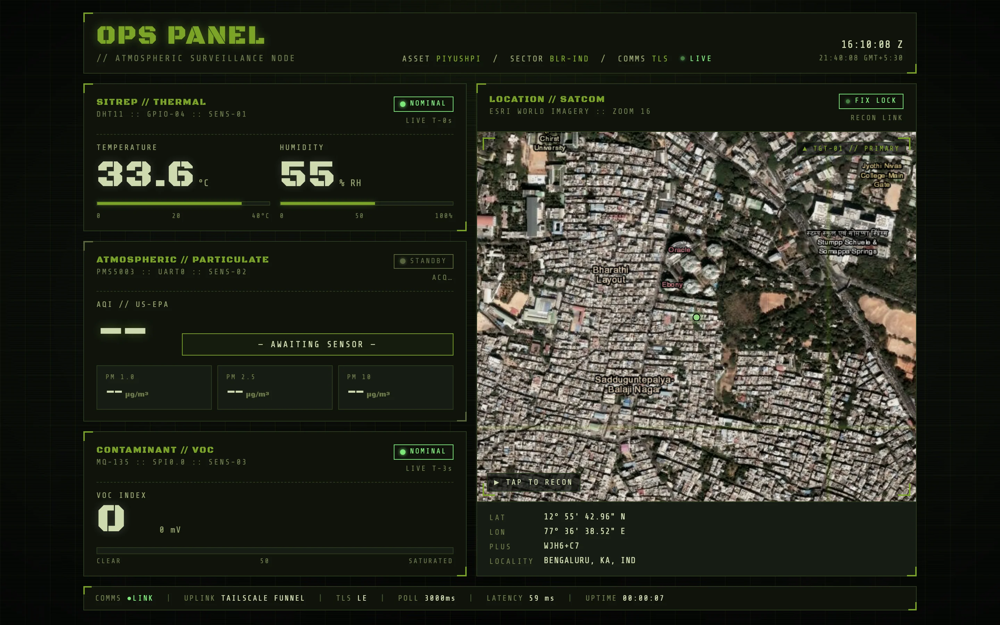
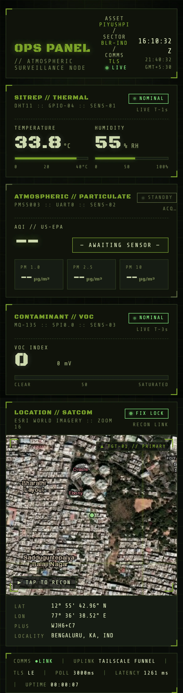

<!-- 
  ████████   ████████   ███████      ████████   ████████   ███   ███   ████████   ███       
  ██     █   ██     █   ██          ██      █   ██     █   ████  ███   ██     █   ██        
  ████████   ████████   ████████    ██████████   ████████   ████ ████   ████████   ██        
  ██         ██               ██   ██      ██   ██     █   ██  ████   ██     █   ██        
  ██         ██         ████████   ██      ██   ██     █   ██   ███   ████████   █████████ 
-->

<p>
  
  &nbsp;
</p>

# pi-weather-ops &nbsp; `// ATMOSPHERIC SURVEILLANCE NODE`

> A Raspberry Pi 4 reading temperature, humidity, particulate matter and VOC contamination — served behind a tactical ops-panel UI, exposed to the public internet on a real Let's Encrypt cert via Tailscale Funnel. One Python file. No framework. No database. <em>Also: the favicon ☝️ is an animated SVG radar sweep that ticks in your browser tab.</em>

[](https://piyushpi.tail641fa8.ts.net/)
[](https://piyushpi.tail641fa8.ts.net/)
[](#deployment)
[](#)
[](#)
[](LICENSE)

**Live:** [`https://piyushpi.tail641fa8.ts.net/`](https://piyushpi.tail641fa8.ts.net/) &nbsp;·&nbsp; **API:** [`/api/now`](https://piyushpi.tail641fa8.ts.net/api/now) &nbsp;·&nbsp; **Health:** `/healthz`



<sub>↑ Desktop view. Live readings on the left, Esri World Imagery + green-dot reticle on the right. Status chips track NOMINAL / CAUTION / CRITICAL per sensor. PMS5003 + MQ-135 sensors arriving tomorrow — they render as `STANDBY` until plugged in.</sub>

<table>
<tr>
<td width="50%">

**Mobile** — full layout collapses to a single column, map is still fully interactive after `▶ TAP TO RECON`.

</td>
<td width="50%" align="center">

</td>
</tr>
</table>

---

## TL;DR

| | |
|---|---|
| **Asset** | `PIYUSHPI` (Raspberry Pi 4B, 8 GB) |
| **Sensors** | DHT11 (T/H) · PMS5003 (PM1.0/PM2.5/PM10) · MQ-135 (VOC via MCP3008 ADC) |
| **Backend** | Single Python file, stdlib `http.server.ThreadingHTTPServer`, three threaded pollers |
| **Frontend** | Inline HTML/CSS/JS · Leaflet + Esri World Imagery · `Black Ops One` + `Share Tech Mono` |
| **Exposure** | Tailscale Funnel → public HTTPS with auto Let's Encrypt cert |
| **Persistence** | None — live readings only. Add `sqlite3` if you want history. |
| **Footprint** | One `.py` file (~1000 lines including HTML), no `pip` deps outside `pigpio`/`pyserial`/`spidev` |

---

## What it does

Three sensors plugged into the Pi's 40-pin header are polled in the background by separate threads. Each thread parses its protocol-specific frame, validates it (checksums for DHT11 and PMS5003, sanity ranges for everything), and updates a shared dict guarded by a `threading.Lock`. The HTTP handler never blocks on hardware — it just reads the dict and serves JSON.

A US-EPA AQI is computed from the PMS5003's PM2.5 reading using the official breakpoint interpolation. An auto-refreshing dashboard renders the readings as a tactical ops panel — corner-bracket cards, callsign labels, Zulu-time header — alongside a satellite map of the sensor's physical location with a pulsing green-dot reticle.

The whole thing is reachable from anywhere on the open internet at `https://<host>.<tailnet>.ts.net/` because Tailscale Funnel terminates TLS for you and forwards plaintext to `localhost:8000`. No port forwarding. No Cloudflare account. No DDNS. No nginx.

---

## Features

```
┌─ SENSORS ──────────────────────────────────────────────────────────────┐
│  DHT11   ▸ T/H over a single-wire bit-banged protocol, decoded via      │
│            pigpio edge callbacks (pure-Python sample loops miss bits    │
│            on a Pi 4 under load)                                        │
│  PMS5003 ▸ 32-byte active-mode frames over UART @ 9600 8N1; PM1.0/2.5/  │
│            10 atmospheric concentrations, checksum-validated            │
│  MQ-135  ▸ analog VOC sensor read through an MCP3008 SPI ADC; raw 10-   │
│            bit value + computed Rs/R0 ratio → 0–100 contamination index │
└────────────────────────────────────────────────────────────────────────┘

┌─ DASHBOARD ────────────────────────────────────────────────────────────┐
│  · live Zulu + local clocks ticking at 1 Hz                             │
│  · three sensor cells with status chips (STANDBY → NOMINAL/CAUTION/     │
│    CRITICAL) and live age counters                                      │
│  · US-EPA AQI category chip colored to band (Good → Hazardous)          │
│  · Leaflet satellite map (Esri World Imagery + boundary labels) with    │
│    pulsing green-dot reticle and DMS coordinate readout                 │
│  · scroll/drag locked by default; `▶ TAP TO RECON` unlocks pan + zoom   │
│  · `prefers-reduced-motion` honored — CRT scanlines disabled            │
└────────────────────────────────────────────────────────────────────────┘

┌─ OPS ──────────────────────────────────────────────────────────────────┐
│  · systemd units for `pigpiod` + `weather-web` — survive reboots        │
│  · Tailscale Funnel for public HTTPS — no router config, no DNS         │
│  · sensor faults are isolated; one bad sensor doesn't crash the server  │
│  · graceful PENDING state when sensors aren't yet plugged in            │
└────────────────────────────────────────────────────────────────────────┘
```

---

## Hardware

### Bill of materials

| Qty | Part | Notes |
|---:|---|---|
| 1 | Raspberry Pi 4B | 2 GB+ is plenty; this is not a CPU-bound project |
| 1 | DHT11 (3-pin module) | Cheap and quirky. **Run at 5 V.** See [field notes](#field-notes). |
| 1 | Plantower PMS5003 | The 5-pack header version with the white plug |
| 1 | MQ-135 module | Analog VOC sensor, heated element, needs 5 V |
| 1 | MCP3008 | 10-bit SPI ADC — Pi has no analog inputs |
| 2 | Resistors (10 kΩ, 20 kΩ) | Voltage divider so MQ-135's 0–5 V analog output is safe for the 3.3 V MCP3008 input |
| ~ | Female–female jumpers | Many. |

### Pinout

```
                                                          ┌─ PMS5003 ─┐
                                                          │ VCC ──── 5V (pin 4)
┌──────────────────── RPi 4 GPIO header ───────────────┐  │ GND ──── GND (pin 14)
│                                                       │  │ TX  ──── pin 10 (BCM 15 / RXD)
│  1  3V3  ──── MCP3008 VDD + VREF                     │  │ RX  ──── pin 8  (BCM 14 / TXD)
│  2  5V0  ──── DHT11 VCC                              │  │ SET ──── pin 11 (BCM 17, hold HIGH)
│  4  5V0  ──── PMS5003 / MQ-135 VCC                   │  │ RST ──── pin 13 (BCM 27, hold HIGH)
│  6  GND  ──── MCP3008 GND                            │  └───────────┘
│  7  BCM 4    ── DHT11 DATA                           │
│  8  BCM 14   ── PMS5003 RX  (Pi TXD)                 │  ┌─ MQ-135 + MCP3008 ─┐
│  9  GND  ──── DHT11 GND                              │  │ MQ AOUT ──┐         │
│ 10  BCM 15   ── PMS5003 TX  (Pi RXD)                 │  │           ├ 10 kΩ ─ MCP CH0
│ 14  GND  ──── PMS5003 GND                            │  │ GND ──────┴ 20 kΩ ─ GND
│ 19  BCM 10   ── MCP3008 DIN  (SPI MOSI)              │  │  (divider keeps ADC ≤ 3.3 V)
│ 21  BCM 9    ── MCP3008 DOUT (SPI MISO)              │  └─────────────────────┘
│ 23  BCM 11   ── MCP3008 CLK  (SPI SCLK)              │
│ 24  BCM 8    ── MCP3008 CS   (SPI CE0)               │
└───────────────────────────────────────────────────────┘
```

### One-time host config

```bash
# enable hardware UART, free it from the serial console
sudo raspi-config nonint do_serial_hw 0
sudo raspi-config nonint do_serial_cons 1

# enable SPI for the MCP3008
sudo raspi-config nonint do_spi 0

# install pigpio daemon (https://abyz.me.uk/rpi/pigpio/)
sudo apt update && sudo apt install -y pigpio
pip3 install --user --break-system-packages pigpio pyserial spidev

sudo reboot
```

---

## Architecture

```
              ┌────────────┐
DHT11  ──────▶│ DHT11Poller│──┐
              └────────────┘  │     ┌─────────────────────┐     ┌──────────────────┐
              ┌────────────┐  ├────▶│   shared dict       │────▶│ Handler /api/now │
PMS5003 ─────▶│PMS5003Poll │──┤     │  + threading.Lock   │     │ Handler /        │
              └────────────┘  │     └─────────────────────┘     │ Handler /healthz │
              ┌────────────┐  │                                  └─────────┬────────┘
MQ-135  ─────▶│ MQ135Poller│──┘                                            │
              └────────────┘                                               │
                                                                  ThreadingHTTPServer
                                                                       :8000 (HTTP)
                                                                            │
                                                                            ▼
                                                                 ┌─────────────────────┐
                                                                 │  tailscaled         │
                                                                 │  → public Funnel    │
                                                                 │  HTTPS on :443      │
                                                                 │  *.tailnet.ts.net   │
                                                                 │  Let's Encrypt cert │
                                                                 └─────────────────────┘
```

The HTTP server never touches hardware. Each sensor thread owns its own driver state and writes JSON-serializable values into a single shared `dict` under a single lock. Errors are recorded per-sensor; the dashboard surfaces them as red corner brackets and a `CRITICAL` chip without killing the other readings.

---

## Install

```bash
# 1. clone
git clone https://github.com/Piyushmishra29/pi-weather-ops.git
cd pi-weather-ops

# 2. wire up sensors per the pinout above

# 3. one-time host config (see Hardware section)

# 4. deploy
sudo cp weather-web.py /home/piyush/weather-web.py
sudo cp systemd/*.service /etc/systemd/system/
sudo systemctl daemon-reload
sudo systemctl enable --now pigpiod weather-web

# 5. verify
curl http://127.0.0.1:8000/api/now
sudo systemctl status weather-web
```

### Configuration

All knobs are constants at the top of `weather-web.py`:

```python
BIND_HOST = "0.0.0.0"
BIND_PORT = 8000

DHT_PIN          = 4         # BCM
PMS_DEVICE       = "/dev/serial0"
MQ135_SPI_BUS    = 0
MQ135_SPI_DEV    = 0
MQ135_CHANNEL    = 0
MQ135_R0_ENV     = 10000.0   # MQ-135 clean-air baseline; calibrate yours

LOCATION_LAT     = 12.9286   # WJH6+C7 Bengaluru — edit for your location
LOCATION_LON     = 77.6107
LOCATION_PLUS    = "WJH6+C7"
LOCATION_LABEL   = "BENGALURU, KA, IND"
ASSET_CALLSIGN   = "PIYUSHPI"
```

---

## API

### `GET /api/now`

Returns the current snapshot from all three sensors. All numeric fields can be `null` if the sensor hasn't reported (yet, or ever).

```json
{
  "temp_c": 32.3,
  "humidity_pct": 57.0,

  "pm1_0": null,
  "pm2_5": null,
  "pm10":  null,
  "aqi":       null,
  "aqi_label": null,
  "aqi_color": null,

  "voc_raw":   0,
  "voc_mv":    0.0,
  "voc_index": 0.0,

  "dht_updated": 1779464174.13,
  "pms_updated": null,
  "mq_updated":  1779464172.91,

  "errors": {
    "dht": null,
    "pms": "uart timeout",
    "mq":  null
  },

  "lat":       12.9286,
  "lon":       77.6107,
  "loc_plus":  "WJH6+C7",
  "loc_label": "BENGALURU, KA, IND",
  "callsign":  "PIYUSHPI",

  "server_ts": "2026-05-22T15:36:17+00:00"
}
```

### `GET /healthz`

```
ok
```

Plain text, HTTP 200. Useful as an Uptime Kuma probe target.

### `GET /`

The tactical dashboard HTML. Polls `/api/now` every 3 s. No build step.

---

## Deployment

### Tailscale Funnel (the "public from anywhere" magic)

```bash
sudo tailscale funnel --bg --https=443 http://localhost:8000
sudo tailscale funnel status
```

This grants the Pi a public HTTPS URL at `https://<machine>.<tailnet>.ts.net/` with a real Let's Encrypt cert auto-renewed by `tailscaled`. The first time you do this, Tailscale will ask you to flip on the Funnel capability for the tailnet in the admin console — one click, then it works.

> Funnel exposes the URL to the entire internet, no auth. If you want this tailnet-only, swap `funnel` for `serve` — same syntax, same TLS, just no public DNS.

### systemd

`weather-web.service` depends on `pigpiod.service`. Both ship in [`systemd/`](systemd/). After `daemon-reload`, enable with:

```bash
sudo systemctl enable --now pigpiod weather-web
```

Restart on change:

```bash
sudo systemctl restart weather-web
journalctl -u weather-web -f
```

---

## Field notes

A.k.a. things I learned in production that aren't in any datasheet.

### DHT11 needs 5 V, not 3.3 V

The datasheet says it works on 3.0–5.5 V. **It does not.** The clone modules sold under the name DHT11 are unreliable at 3.3 V — they'll idle-high (so a static read looks fine) but they never acknowledge the host start pulse. Move VCC from pin 1 (3.3 V) to **pin 2 (5 V)** and they wake up immediately. The data line is open-drain pulled up to whatever VCC is, so the 5 V signal is fine through the Pi's pull-up.

### DHT11 decoding is timing-critical — use `pigpio` callbacks

Pure-Python sample loops (`time.perf_counter` + `lgpio.gpio_read`) can capture the waveform on a Pi 4 — sample rates of ~3 µs/sample are achievable — but bit detection still fails intermittently because of GIL scheduling. The `pigpio` daemon attaches a kernel-level edge callback per pin and timestamps in microseconds. The decoder ends up reading the line as: skip the first HIGH (MCU release), skip the second HIGH (sensor ACK), then take the next 40 HIGH-pulse durations as bits (HIGH > 45 µs = `1`, else `0`).

### MCU release + DHT ACK = two HIGHs to skip, not one

A bunch of public DHT11 decoders skip exactly one HIGH and end up with a checksum that *passes* on a frame shifted by one bit (`humidity: 155.0 %` was my favorite). Subtle bug. Look at the **first six** HIGH-pulse durations from the sensor — the first two are ~20–40 µs (release) and ~80 µs (ACK), the rest oscillate 26 µs ↔ 70 µs (the actual bits).

### PMS5003 active mode is fine; passive mode is a trap

In passive mode you send a poll command, the sensor responds with one frame. In active mode it just streams a frame per second forever. For a always-on dashboard, active mode is one less moving part.

### MQ-135 isn't a calibrated PPM sensor

It's a heated metal-oxide gas-sensitive resistor. The output voltage is *qualitative*. Reporting it as "VOC Index 0–100" is honest; reporting it as "23 PPM CO₂" is not — that requires lab calibration against known gas concentrations.

### Tailscale Funnel needs a one-time tailnet capability toggle

Both `funnel` and `serve` are gated behind a tailnet feature flag in the admin console. The first `tailscale funnel` call prints the URL to enable it. Click it once, then `funnel` works forever.

### MagicDNS rewrites `<tailnet>.ts.net` to the tailnet IP on Tailscale devices

So `curl https://piyushpi.tail641fa8.ts.net/` from your Mac doesn't actually go through the public Funnel — it goes direct over the tailnet. Useful for development. To test "actually public", `curl` from outside the tailnet (a phone on cellular, an Anthropic WebFetch, etc.).

---

## Roadmap

- [ ] Calibrate MQ-135 R₀ in clean air, output an estimated CO₂-equivalent PPM
- [ ] Add a BME680 for pressure + a calibrated gas index
- [ ] Optional SQLite ring buffer for last-24h sparklines (no full history DB)
- [ ] MQTT publisher → Home Assistant
- [ ] HTTP Basic auth toggle for the public dashboard
- [ ] PWA manifest + offline tile cache for the map

## License

[MIT](LICENSE) — do whatever you want, but the field notes about DHT11 voltages are how I tortured myself for an hour, please learn from them.

---

<sub>built on `piyushpi` · operated from Bengaluru · status `LIVE` at <a href="https://piyushpi.tail641fa8.ts.net/">piyushpi.tail641fa8.ts.net</a></sub>
